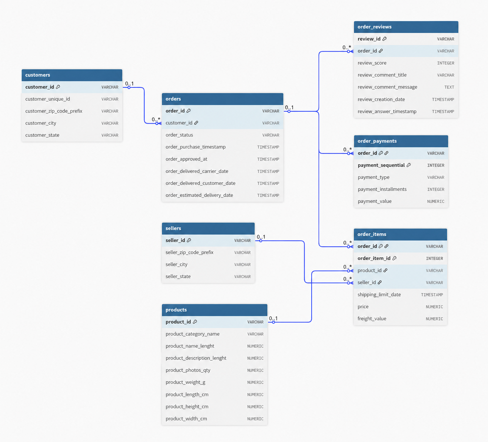
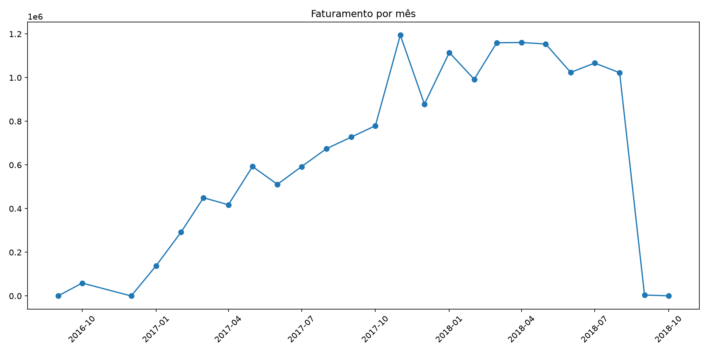
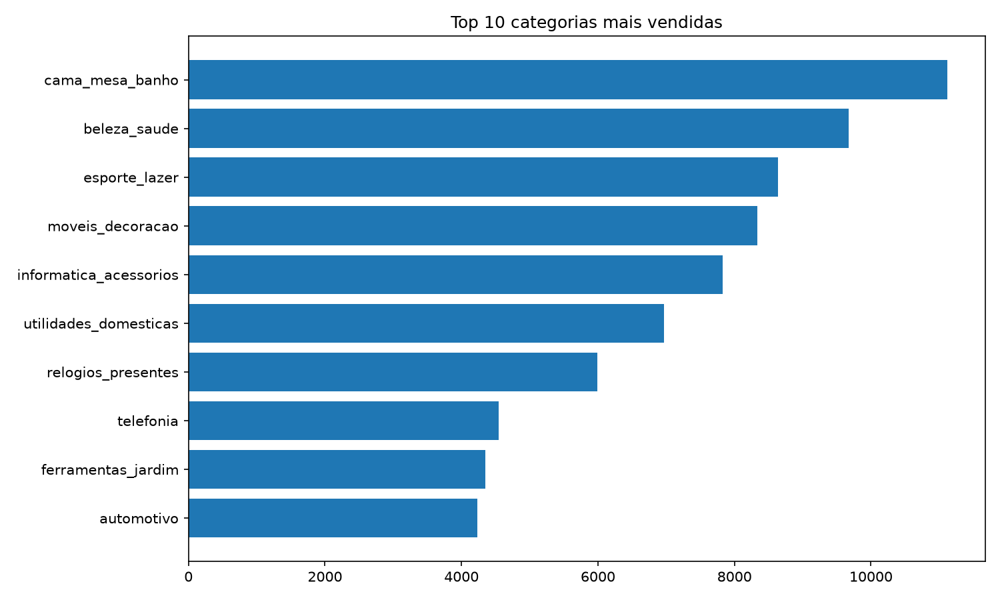
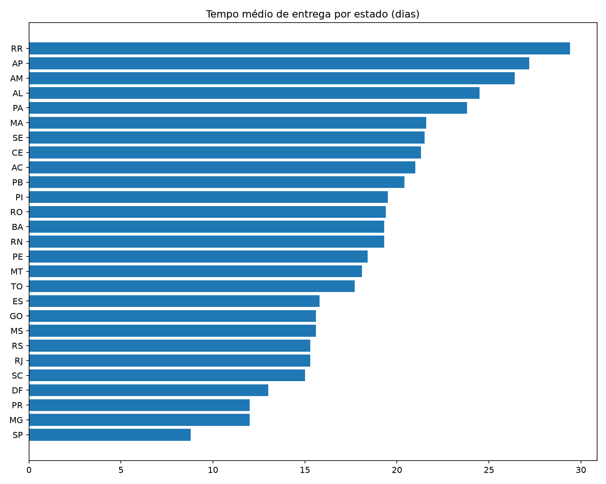
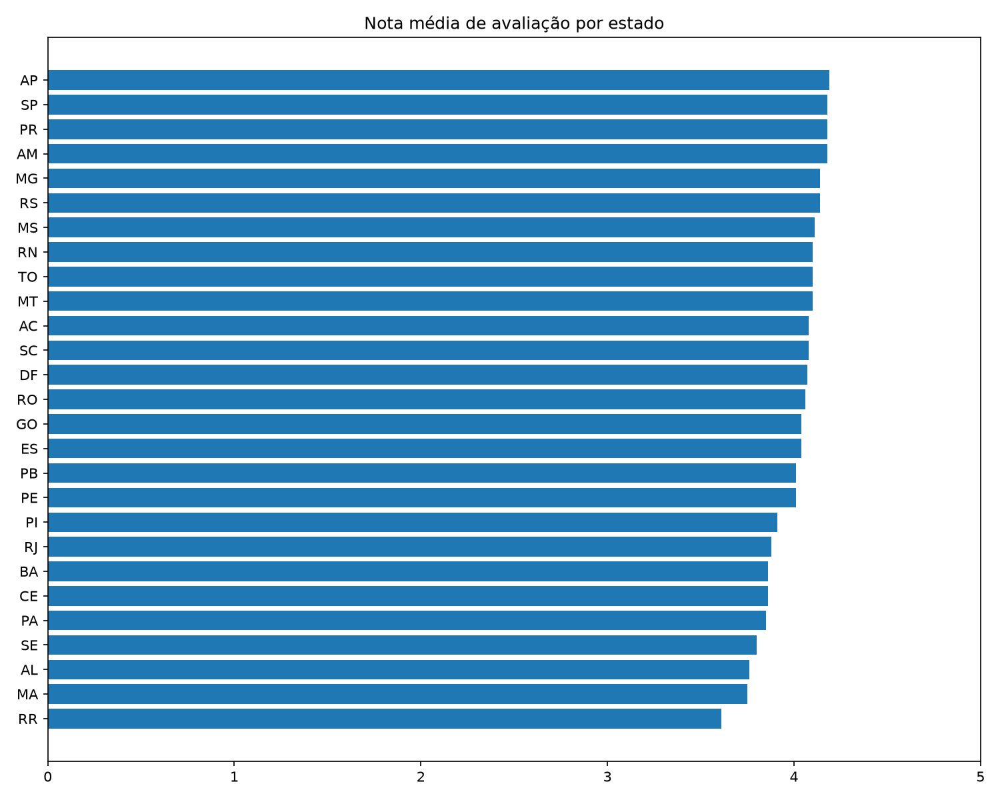

# 📦 Pipeline Olist Vendas

> Pipeline de dados desenvolvido em Python e PostgreSQL para transformar dados brutos de e-commerce em informações prontas para análise.

## Sobre
## 📌 Sobre o projeto

Este projeto surgiu de uma vontade simples: pegar dados desorganizados e transformá-los em algo estruturado e útil para análise. Como estou começando meus estudos em Engenharia de Dados, usei o dataset público da Olist como uma oportunidade para aprender, na prática, como funciona uma pipeline de dados de ponta a ponta mesmo sem experiência.

A partir dos arquivos CSV, construí uma pipeline ETL utilizando Python e Pandas para realizar a extração e transformação dos dados, PostgreSQL para armazenamento e organização das informações e SQL para realizar as análises. O objetivo foi entender na prática como diferentes etapas se conectam, desde os dados brutos até a geração de informações que podem ser utilizados por Analista ou Ciêntistas de dados.

O maior desafio foi justamente a falta de experiência. Eu ainda não tinha trabalhado com algumas das bibliotecas utilizadas nem tinha experiência construindo uma pipeline completa. Também tive bastante dificuldade utilizando o terminal Linux, principalmente durante a configuração do ambiente, conexão com o PostgreSQL e execução das etapas de extração, transformação e carga. Muitos dos problemas foram resolvidos na base de pesquisa, testes e muitos e erros.

Durante o desenvolvimento, também utilizei IA como ferramenta de apoio para consultar conceitos, entender comandos e bibliotecas que ainda não conhecia, investigar erros e organizar algumas partes do código e da documentação. Procurei usar a IA como uma forma de acelerar o aprendizado, entendendo as soluções em vez de apenas copiá-las.

No final, mais do que construir uma pipeline que funcionasse, o projeto me ajudou a entender melhor o processo de ETL, o relacionamento entre diferentes tabelas, a integração entre Python e PostgreSQL e a importância de organizar os dados antes de analisá-los. Foi meu primeiro projeto mais completo nessa área e serviu como uma base prática para continuar evoluindo nos estudos de Engenharia de Dados.


## 🛠️ Tecnologias

- **Python** — desenvolvimento do pipeline
- **Pandas** — tratamento e transformação dos dados
- **PostgreSQL** — armazenamento e modelagem relacional
- **SQLAlchemy** — conexão e carga dos dados
- **psycopg2** — conexão com PostgreSQL
- **SQL** — criação das tabelas e análises
- **Matplotlib** — visualização dos resultados
- **python-dotenv** — gerenciamento das variáveis de ambiente

## 🗄️ Banco de dados

O projeto utiliza um modelo relacional com 7 tabelas:

`customers` · `orders` · `order_items` · `order_payments` · `order_reviews` · `products` · `sellers`




# 📊 Principais resultados


###  Faturamento
O faturamento apresentou crescimento ao longo do período analisado, atingindo o pico de R$ 1.194.882,80 em novembro de 2017.



### Categorias
As categorias `cama_mesa_banho` e `beleza_saude` apresentaram o maior volume de vendas na análise, com 11.115 e 9.670 vendas, respectivamente.



### Logística
O tempo médio de entrega variou significativamente entre os estados:
- São Paulo: 8,8 dias
- Roraima: 29,4 dias



### Avaliações
Também foi analisada a distribuição das avaliações dos pedidos por estado, utilizando as notas disponíveis na tabela `order_reviews`.



### Ticket médio
O ticket médio encontrado na análise foi de aproximadamente R$ 160,99 por pedido.

## Estrutura do projeto

```text
pipeline-olist-vendas/
├── data/raw/          # Dados brutos
├── docs/images/       # Gráficos e imagens
├── src/
│   ├── extract.py     # Extração
│   ├── transform.py   # Transformação
│   ├── load.py        # Carga
│   ├── db_connection.py
│   └── gerar_graficos.py
├── sql/
│   ├── criar_tabelas.sql
│   └── consultas_analise.sql
├── main.py
├── requirements.txt
└── README.md
```
## 🔴 Como executar

### 1. Clone o repositório

>git clone https://github.com/thiagoferlopes/pipeline-olist-vendas.git
cd pipeline-olist-vendas
### 2. Crie o ambiente virtual

>python -m venv venv

####  Ative o ambiente:

#### Linux / macOS

> source venv/bin/activate

#### Windows

> venv\Scripts\activate

### 3. Instale as dependências

>pip install -r requirements.txt

### 4. Configure os dados

Baixe o dataset da Olist no Kaggle e coloque os arquivos .csv em:

>data/raw/

Depois, crie o arquivo .env a partir do .env.example e configure as credenciais do PostgreSQL.

### 5. Crie o banco de dados

Crie um banco chamado olist_vendas e execute:

>psql -d olist_vendas -f sql/criar_tabelas.sql

### 6. Execute o pipeline

>python main.py

##### O pipeline realiza as etapas: 
Extração → Transformação → Carga


### 7. Execute as análises
> psql -d olist_vendas -f sql/consultas_analise.sql

#### Para gerar os gráficos:

> python src/gerar_graficos.py


---
# 📚 Dataset

O projeto utiliza o **Brazilian E-Commerce Public Dataset by Olist**, disponibilizado publicamente no Kaggle:

https://www.kaggle.com/datasets/olistbr/brazilian-ecommerce

---

# 👨‍💻 Autor

**Thiago Ferreira**

Estudante de Ciência de Dados com foco em **Dados e Engenharia de Dados**.

[GitHub](https://github.com/thiagoferlopes) |
[LinkedIn](https://www.linkedin.com/in/thiagoferlopes/)